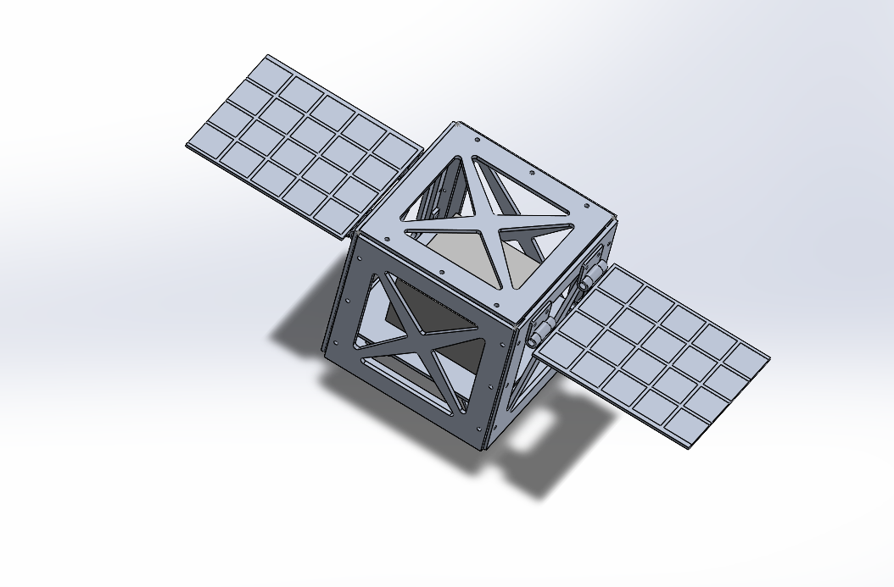
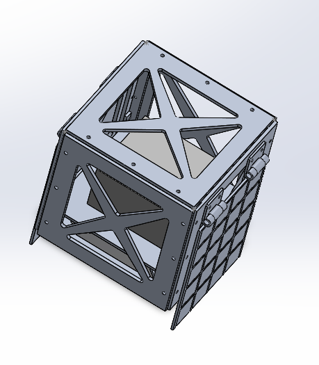

# CubeSat Deployable Structure — v2 (Multi-Part Assembly)

A full multi-part 1U CubeSat structural assembly with mass-optimized lattice paneling and a deployable solar panel mechanism, modeled in SolidWorks and verified with FEA. This is a follow-up to a simpler single-body CubeSat chassis ([v1]([../cubesat-structural-chassis](https://github.com/christancottle/cubesat-structural-chassis))), rebuilt from the ground up as a real multi-part assembly with bolted joints, a working hinge mechanism, and a lightweighted structure.

## Overview

Where v1 modeled the CubeSat structure as a single solid body, v2 rebuilds it as a genuine assembly: individually modeled rails, wall panels, brackets, a mounting deck, and a deployable solar panel system, all connected with realistic fastener geometry and mates. The goal was to practice real assembly modeling (mates, fastener stack-ups, mechanisms) while pushing the structural design further with mass-saving lattice cutouts and a working deployment hinge.

## Design

- **Core structure:** 4 L-shaped rail posts (CDS-compliant 8.5mm profile, 1mm fillets) and 4 wall panels, bolted together with M2 tapped/clearance hole pairs
- **Mounting deck:** supported on 4 custom L-bracket standoffs, bolted to the rails
- **Lattice paneling:** all 6 outer faces (4 walls + top/bottom end panels) use an X-brace cutout pattern to reduce structural mass while preserving load paths
- **Deployable solar panels:** two panels, each attached via a 2-point knuckle hinge (SolidWorks Hinge mate) allowing free rotation between stowed and deployed positions
- **Payload placeholder:** a custom-density block (~0.4 kg) representing a generic electronics/battery stack, for a real mass budget check
- **Material:** 6061-T6 aluminum (structure), custom-density placeholder (payload)




## Structural Analysis

**Load case:** 10g quasi-static axial acceleration (98 m/s²), representing launch, applied with panels folded to the stowed configuration.

**Fixtures:** the four rail posts' outer faces are fixed, representing the true P-POD dispenser contact surface — more accurate than v1's simplification, since the rails are now separate parts from the walls rather than one continuous face.

**Contact:** global bonded contact across all mated joints (rail-to-wall, bracket-to-rail, deck-to-bracket, hinge knuckles), as a first-pass simplification of the bolted/pinned connections.

**Result:** maximum von Mises stress of 15.0 MPa against a 275 MPa yield strength for 6061-T6 aluminum — a safety factor of approximately **18x**.

| Version | Construction | Max stress | Safety factor |
|---|---|---|---|
| v1 | Single solid body, no cutouts | 0.158 MPa | ~1,750x |
| v2 | Multi-part assembly, lattice-cut walls | 15.0 MPa | ~18x |

**Key finding:** introducing the lattice mass-reduction pattern and realistic bolted-joint construction increased peak stress by roughly 95x compared to the solid v1 design, but the structure retains a healthy, realistic safety margin — comparable to safety factors reported for real flight CubeSat structures (typically single-digit to low double-digit multiples). This reflects a legitimate mass-vs-strength trade-off in spacecraft structural design.

## Mechanism

The solar panels rotate freely about a two-point knuckle hinge, modeled with SolidWorks' Hinge mate (concentric + coincident constraint pair). The mechanism was verified by manually driving the panel between stowed and deployed positions in the assembly.

## Repository Contents

```
CAD/          SolidWorks assembly and part files
drawings/     Dimensioned engineering drawing (PDF)
analysis/     FEA result screenshots and summary
images/       Renders used in this README
```

## Future Work

- Model discrete fastener hardware (screws, nuts) in place of simplified bonded contacts
- Add a physical stop feature or mate angle limit to cap hinge rotation at 90°
- End-panel deployment switch mount for launch/deployment sequencing
- Modal (natural frequency) and random vibration analysis per NASA-STD-5001 / GEVS, in addition to the current static quasi-static check
- Lateral (off-axis) load case

## Tools

SolidWorks 2024/2025 (CAD, assembly, mates), SolidWorks Simulation (FEA)
